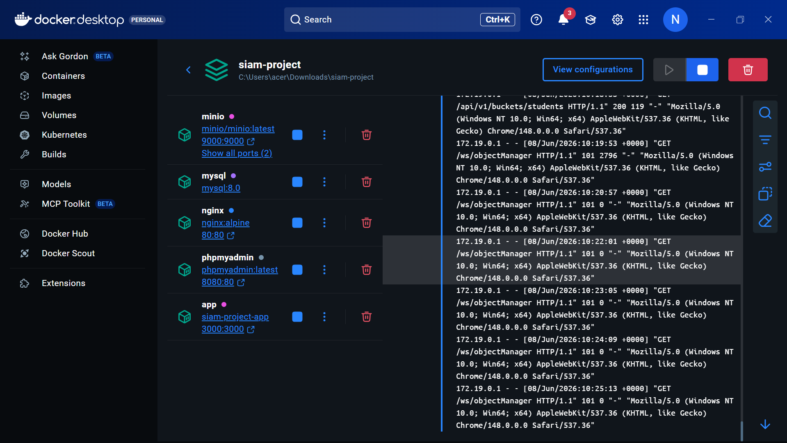
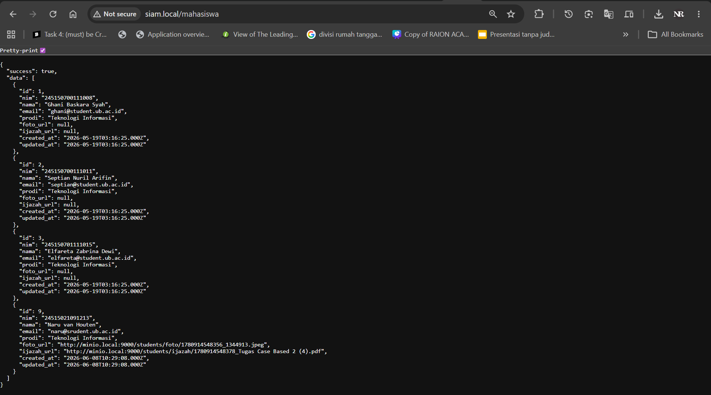
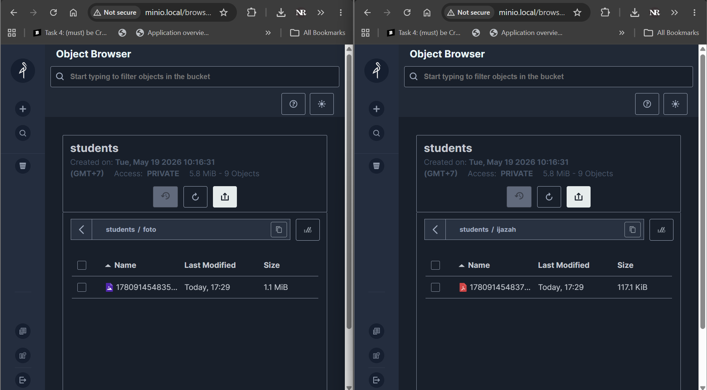
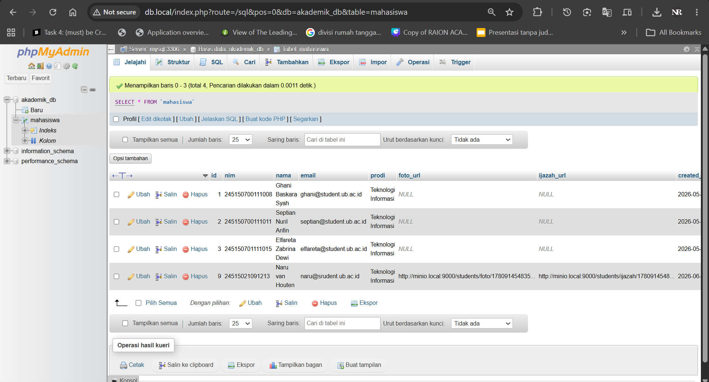
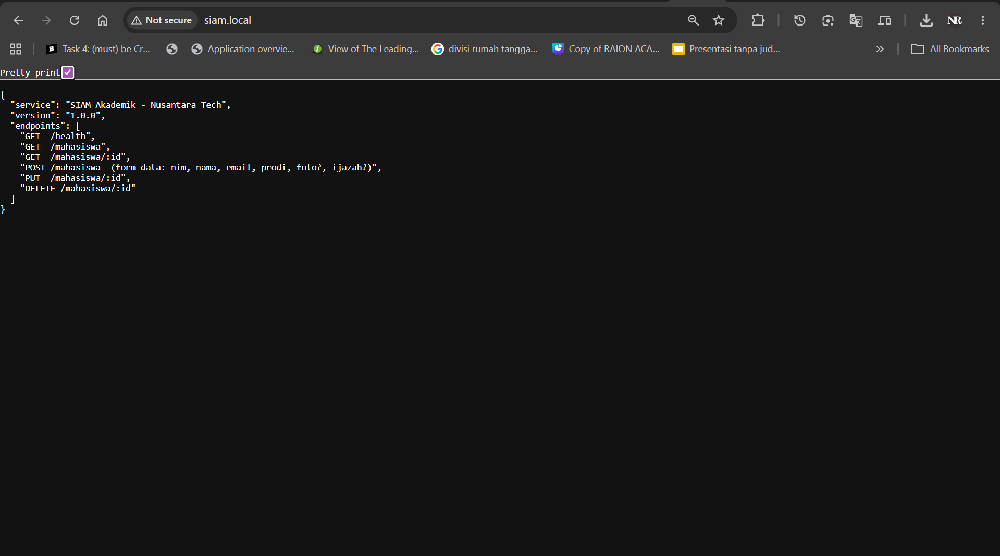

# SIAM Akademik — Development Environment in a Box

**Mata Kuliah:** Administrasi Sistem  
**Topik:** Standardisasi Lingkungan Development Terintegrasi (App, Database & Object Storage)  
**Kelas:** TI C

| Nama | NIM |
|------|-----|
| Ghani Baskara Syah | 245150700111008 |
| Septian Nuril Arifin | 245150700111011 |
| Elfareta Zabrina Dewi | 245150701111015 |

---

## Deskripsi Proyek

Proyek ini adalah implementasi **Development Environment in a Box** menggunakan Docker dan Docker Compose untuk **Sistem Informasi Akademik Mahasiswa (SIAM)** milik *Nusantara Tech*.

Tujuannya adalah menyelesaikan masalah *"It works on my machine"* dengan menstandardisasi seluruh lingkungan development dalam satu perintah `docker-compose up`.

Aplikasi ini memiliki fitur:
- **CRUD Data Mahasiswa** (simpan ke MySQL)
- **Upload File Dokumen** (foto & scan ijazah disimpan ke MinIO)
- **Custom Domain Lokal** via Nginx (`siam.local`, `minio.local`, `db.local`)

---

## Arsitektur Sistem

```
                  ┌───────────────────────────────────────────────────────────┐
                  │                   Docker Network: siam.net                │
                  │                                                           │
  siam.local ───► │  nginx:80 ──► app:3000 ──► mysql:3306                    │
  minio.local ──► │  nginx:80 ──► minio:9001  (MinIO Console)               │
  db.local ─────► │  nginx:80 ──► phpmyadmin:80 ──► mysql:3306              │
                  │                                                           │
                  │  DNS Internal Docker:                                     │
                  │    app · mysql · minio · phpmyadmin · nginx               │
                  └───────────────────────────────────────────────────────────┘
```

> **Prinsip Konfigurasi Network:** Semua service berkomunikasi menggunakan **service name** (bukan `localhost`) di dalam Docker network `siam.net`. Nginx berperan sebagai *reverse proxy* sekaligus simulasi *nameserver* lokal melalui konfigurasi `server_name`.

---

## Stack Teknologi

| Komponen | Image Docker | Port Host | URL Akses | Keterangan |
|---|---|---|---|---|
| **Aplikasi Web** | `node:20-alpine` | `3000` | `http://siam.local` | Express.js CRUD API |
| **Database** | `mysql:8.0` | *(internal)* | `mysql:3306` | Data operasional mahasiswa |
| **Object Storage** | `minio/minio:latest` | `9000`, `9001` | `http://minio.local` | Penyimpanan file (simulasi S3) |
| **GUI Database** | `phpmyadmin:latest` | `8080` | `http://db.local` | Antarmuka visual MySQL |
| **Reverse Proxy** | `nginx:alpine` | `80` | Semua domain `.local` | Virtual host & proxy |

---

## Struktur Direktori

```
siam-project/
├── docker-compose.yml       # Orkestrasi semua service
├── .env                     # Konfigurasi aktif (tidak di-commit ke Git)
├── .env.example             # Contoh konfigurasi tanpa password asli
├── .gitignore
├── README.md
├── setup-hosts.bat          # Script setup DNS lokal (Windows)
├── test.html                # Halaman HTML untuk pengujian upload
├── nginx/
│   └── nginx.conf           # Konfigurasi Nginx (virtual host)
└── app/
    ├── Dockerfile            # Build image Node.js (non-root, alpine)
    ├── package.json
    ├── init.sql              # Inisialisasi tabel database otomatis
    └── src/
        └── index.js          # Source code Express.js
```

---

## Cara Build dan Menjalankan Environment

### Prasyarat
- **Docker Engine** (v20+) sudah terinstall dan berjalan
- **Docker Compose** sudah terinstall
- Port `80`, `3000`, `8080`, `9000`, `9001` tidak sedang dipakai oleh aplikasi lain

---

### Langkah 1 — Siapkan Direktori Proyek

```bash
cd siam-project
```

---

### Langkah 2 — Setup Custom DNS (Nameserver Lokal)

Agar bisa akses via domain custom (`siam.local`, `minio.local`, `db.local`) tanpa menggunakan `localhost`:

**Jalankan file berikut sebagai Administrator:**

> Klik kanan file `setup-hosts.bat` → **Run as Administrator** → Klik *Yes*

Script ini akan otomatis menambahkan entri berikut ke file `C:\Windows\System32\drivers\etc\hosts`:

```
127.0.0.1  siam.local
127.0.0.1  minio.local
127.0.0.1  db.local
```

> **Penjelasan:** File `hosts` Windows berfungsi seperti DNS lokal. Browser akan mengarahkan domain `.local` ke `127.0.0.1`, lalu Nginx di dalam Docker yang meneruskan request ke service yang sesuai berdasarkan `server_name`.

---

### Langkah 3 — Buat File `.env`

Salin file contoh lalu sesuaikan dengan konfigurasi yang diinginkan:

```bash
cp .env.example .env
```

Contoh isi file `.env`:

```env
# Database (MySQL)
MYSQL_ROOT_PASSWORD=rootpassword_aman
MYSQL_DATABASE=akademik_db
MYSQL_USER=admin
MYSQL_PASSWORD=password_aman

# Aplikasi Node.js
APP_PORT=3000
DB_HOST=mysql
DB_PORT=3306
DB_NAME=akademik_db
DB_USER=admin
DB_PASSWORD=password_aman

# MinIO (Object Storage)
MINIO_ROOT_USER=minioadmin
MINIO_ROOT_PASSWORD=miniopassword_aman
MINIO_BUCKET=students
MINIO_ENDPOINT=minio
MINIO_PORT=9000
MINIO_PUBLIC_HOST=localhost

# phpMyAdmin
PMA_HOST=mysql
PMA_PORT=3306
```

---

### Langkah 4 — Build dan Jalankan Semua Container

```bash
docker-compose up -d --build
```

- Flag `-d` → Berjalan di *background* (detached mode)
- Flag `--build` → Memaksa Docker mem-build ulang image aplikasi

---

### Langkah 5 — Cek Status Container

```bash
docker-compose ps
```

Output yang diharapkan (semua berstatus `Up`):

```
NAME              IMAGE                STATUS             PORTS
siam_app          siam-project-app     Up (healthy)       0.0.0.0:3000->3000/tcp
siam_mysql        mysql:8.0            Up (healthy)       3306/tcp
siam_minio        minio/minio:latest   Up (healthy)       0.0.0.0:9000-9001->9000-9001/tcp
siam_phpmyadmin   phpmyadmin:latest    Up                 0.0.0.0:8080->80/tcp
siam_nginx        nginx:alpine         Up                 0.0.0.0:80->80/tcp
```

---

## Cara Mengakses Layanan

### 🌐 Aplikasi Web (SIAM API)
| | |
|---|---|
| **Via Nginx (custom domain)** | http://siam.local |
| **Langsung** | http://localhost:3000 |

### 🗄️ Dashboard MinIO (Object Storage)
| | |
|---|---|
| **Via Nginx (custom domain)** | http://minio.local |
| **Langsung** | http://localhost:9001 |
| **Username** | Nilai `MINIO_ROOT_USER` di `.env` |
| **Password** | Nilai `MINIO_ROOT_PASSWORD` di `.env` |
| **Bucket** | `students` (dibuat otomatis saat pertama kali app berjalan) |

### 📊 phpMyAdmin (GUI Database)
| | |
|---|---|
| **Via Nginx (custom domain)** | http://db.local |
| **Langsung** | http://localhost:8080 |
| **Username** | Nilai `MYSQL_USER` di `.env` |
| **Password** | Nilai `MYSQL_PASSWORD` di `.env` |
| **Database** | `akademik_db` |

---

## Panduan Pengujian API

Endpoint yang tersedia:

| Method | Endpoint | Keterangan |
|--------|----------|------------|
| `GET` | `/health` | Cek status aplikasi |
| `GET` | `/mahasiswa` | Ambil semua data mahasiswa |
| `GET` | `/mahasiswa/:id` | Ambil mahasiswa berdasarkan ID |
| `POST` | `/mahasiswa` | Tambah mahasiswa baru + upload file |
| `PUT` | `/mahasiswa/:id` | Update data mahasiswa |
| `DELETE` | `/mahasiswa/:id` | Hapus data mahasiswa |

### Cek Health Aplikasi
```bash
curl http://siam.local/health
# Expected: {"status":"ok","service":"siam-akademik"}
```

### GET — Ambil Semua Data Mahasiswa
```bash
curl http://siam.local/mahasiswa
```

### POST — Tambah Mahasiswa Baru (dengan upload file)
```bash
curl -X POST http://siam.local/mahasiswa \
  -F "nim=245150700111099" \
  -F "nama=Mahasiswa Baru" \
  -F "email=baru@student.ub.ac.id" \
  -F "prodi=Teknologi Informasi" \
  -F "foto=@/path/ke/foto.jpg" \
  -F "ijazah=@/path/ke/ijazah.pdf"
```

---

## Bukti Pengujian

### 1. Semua Container Berstatus `Up`

> *Screenshot `docker-compose ps` — semua container berstatus Up dan Healthy*

<!-- SCREENSHOT: Tempelkan screenshot docker-compose ps di sini -->


---

### 2. Koneksi Aplikasi ke Database (MySQL)

> *Screenshot response API `GET /mahasiswa` menampilkan data dari MySQL*

<!-- SCREENSHOT: Tempelkan screenshot hasil curl/browser GET /mahasiswa di sini -->


---

### 3. Dashboard MinIO — File Berhasil Terupload

> *Screenshot Dashboard MinIO menampilkan bucket `students` dan file yang berhasil diupload*

<!-- SCREENSHOT: Tempelkan screenshot MinIO dashboard di sini -->


---

### 4. phpMyAdmin — Tabel dan Data Mahasiswa

> *Screenshot phpMyAdmin menampilkan tabel `mahasiswa` beserta data yang tersimpan*

<!-- SCREENSHOT: Tempelkan screenshot phpMyAdmin di sini -->


---

### 5. Akses via Custom Domain `siam.local`

> *Screenshot browser mengakses aplikasi melalui `http://siam.local` (Nginx reverse proxy)*

<!-- SCREENSHOT: Tempelkan screenshot browser siam.local di sini -->


---

## Konfigurasi Network & Volume

### Custom Bridge Network
Semua service terhubung dalam satu network bernama `siam.net` dengan driver `bridge`. Komunikasi antar service menggunakan **service name** sebagai hostname, sesuai ketentuan tugas:

```yaml
# Di dalam docker-compose.yml
networks:
  siam.net:
    driver: bridge
```

Contoh komunikasi internal:
- App → Database: `mysql:3306`
- App → MinIO API: `minio:9000`
- Nginx → App: `http://app:3000`

### Persistensi Data (Docker Volume)
Data tidak akan hilang meskipun container dihentikan atau dihapus:

```yaml
volumes:
  mysql_data:   # Menyimpan data MySQL di /var/lib/mysql
  minio_data:   # Menyimpan file upload di /data
```

Untuk menghentikan container **tanpa** menghapus data:
```bash
docker-compose down
```

Untuk menghentikan container **dan** menghapus semua data (reset total):
```bash
docker-compose down -v
```

---

## Troubleshooting

### Container `app` tidak mau start
MySQL atau MinIO mungkin belum siap. Aplikasi dikonfigurasi untuk *retry* otomatis setiap 5 detik. Tunggu sebentar dan cek log:
```bash
docker-compose logs -f app
```

### `siam.local` tidak bisa dibuka di browser
Pastikan file `setup-hosts.bat` sudah dijalankan sebagai **Administrator**. Cek isi hosts file:
```bash
# Di PowerShell
Get-Content C:\Windows\System32\drivers\etc\hosts | Select-String "local"
```

### Bucket MinIO tidak muncul
Bucket `students` dibuat otomatis oleh aplikasi saat pertama kali terhubung ke MinIO. Pastikan container `app` berstatus `healthy`, lalu refresh dashboard MinIO.

### Port sudah dipakai
Ubah port host di `docker-compose.yml` (bagian `ports:`), misalnya ganti `80:80` menjadi `8000:80`.
